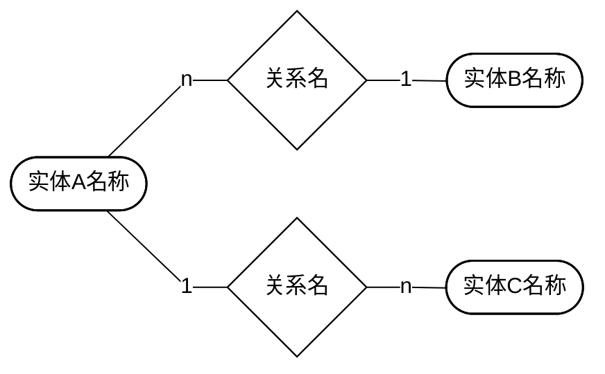
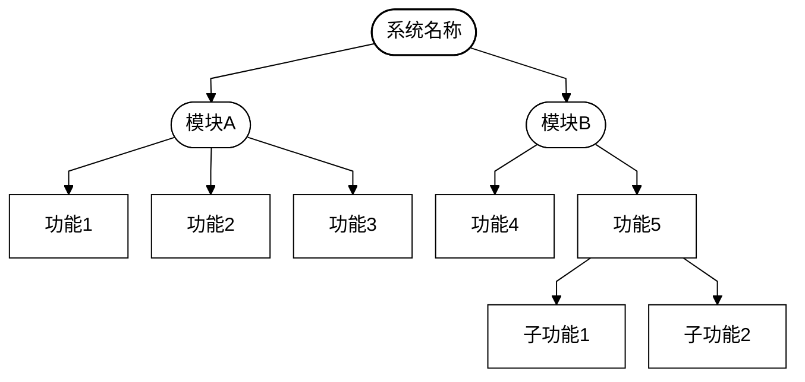
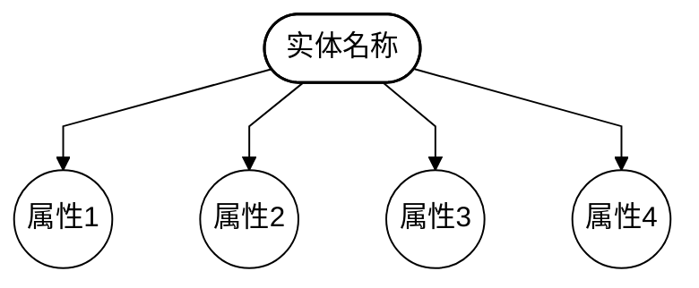
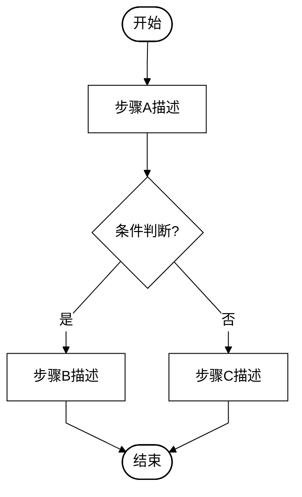
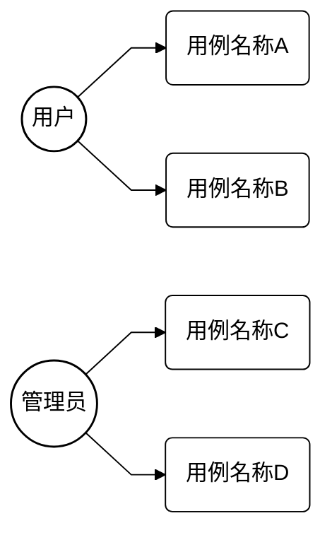
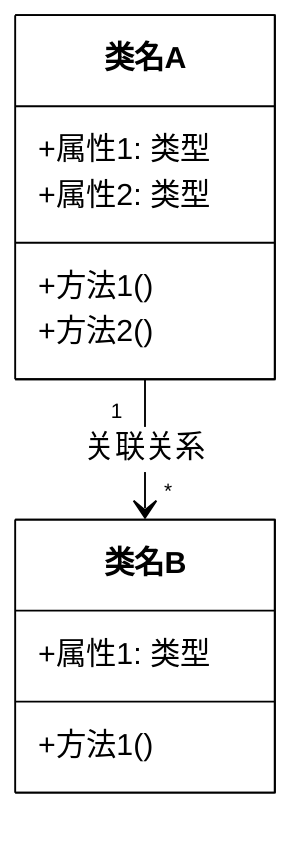

# 仁爱学院计算机论文编写

天津仁爱学院智算工程学院计算机专业毕业论文全流程编写技能。

## 适用场景

- 用户需要从零编写毕业论文
- 用户有markdown内容文档和源代码，需要生成格式正确的docx论文
- 用户需要降AI味、降重
- 用户需要交叉引用和参考文献排序

## 检查点文档机制

**解决上下文溢出问题**：本skill执行过程中上下文必然溢出，导致数据丢失。通过检查点文档，即使上下文完全丢失，新会话也能从断点恢复。

### 总入口：进度总览

**每次执行skill的第一步，必须先读取总入口文件**：

1. 检查 `thesis-checkpoints/进度总览.md` 是否存在
2. 如存在，读取并按指示恢复（跳到对应步骤继续）
3. 如不存在，从头开始（步骤1）

**每次步骤变更时，必须更新总入口文件**：

```markdown
# 论文编写进度总览

## 当前状态

- 当前步骤：步骤N（[步骤名称]）
- 完成状态：[进行中/已完成]

## 已完成步骤

- 步骤1：✅ [完成日期]
- 步骤2：✅ [完成日期]
- ...

## 迭代信息（步骤18专用）

- 当前迭代轮次：[1/2/3]
- 迭代原因：[AIGC率未达标/其他]
- 回退到的步骤：[步骤12/步骤14/步骤15]
- 已回退完成的步骤：[步骤12✅ → 步骤14✅ → 步骤15✅]

## 下一步操作

- [具体操作描述]

## 关键注意事项

- [从最近完成的检查点中提取的注意事项]
```

### 检查点文件路径

所有检查点文件存放在 `thesis-checkpoints/` 目录（用户可见目录）：

```text
thesis-checkpoints/
├── 进度总览.md              ← 总入口，每次步骤变更时更新
├── 步骤1-检查点.md
├── 步骤2-检查点.md
├── 步骤3-检查点.md
├── 步骤4-检查点.md
├── 步骤4.5-检查点.md
├── 步骤5-检查点.md
├── 步骤6-检查点.md
├── 步骤7-检查点.md
├── 步骤8-检查点.md
├── 步骤9-检查点.md
├── 步骤10-检查点.md
├── 步骤11-检查点.md
├── 步骤12-检查点.md
├── 步骤13-检查点.md
├── 步骤14-检查点.md
├── 步骤15-检查点.md
├── 步骤16-检查点.md
├── 步骤17-检查点.md
└── 步骤18-检查点.md
```

### 检查点操作流程

**步骤执行前**：

1. 读取 `thesis-checkpoints/进度总览.md`，确认当前进度
2. 读取对应的 `thesis-checkpoints/步骤N-检查点.md`
3. 按检查点中的"恢复时需读取的文件"列表读取必要文件
4. 按检查点中的"恢复后跳过的子任务"跳过已完成部分
5. 从断点继续执行

**步骤执行结束前**：

1. 生成 `thesis-checkpoints/步骤N-检查点.md`
2. 更新 `thesis-checkpoints/进度总览.md`

**验证门失败时的检查点处理**：

- 验证门失败需要回退重做时，当前检查点的完成状态必须标记为"部分完成（验证门N失败，需回退到步骤X重做）"
- 禁止将验证门失败的步骤标记为"已完成"，否则恢复时会跳过该步骤
- 回退重做时，被回退步骤的检查点应在重做完成后重新生成（覆盖旧的"部分完成"检查点）

### 检查点内容模板

```markdown
# 步骤N：[步骤名称] - 检查点

## 完成状态

[已完成/部分完成（说明完成到哪一步）]

## 关键产出物路径

- [产出物1路径]
- [产出物2路径]

## 本步骤关键数据

- [步骤专属的关键数据，见各步骤"检查点必记内容"]

## 恢复时需读取的文件

- [文件1路径]：[读取目的]
- [文件2路径]：[读取目的]

## 恢复后跳过的子任务

- [已完成的子任务1]
- [已完成的子任务2]

## 下一步注意事项

- [注意事项1]
- [注意事项2]

## 遗留问题

- [问题1]
- [问题2]
```

## 用户文件夹结构

用户工作目录必须包含以下三个文件夹：

```text
工作目录/
├── 论文内容/          ← 用户的markdown文档（任务书、开题报告等）
├── 源代码/            ← 用户的项目源代码
└── 仁爱学院论文工具/   ← 本skill打包的工具环境
    ├── thesis_template.docx   ← 100%正确格式的Word模板
    ├── generate.py            ← Python生成脚本
    ├── thesis_content_example.md ← Markdown内容格式示例
    ├── 写作策略.md        ← 范文风格分析 + AIGC防御规则 [实际路径: references/]
    └── references/
        └── diagram_templates/  ← 图片标准模版（4种）
            ├── 结构图标准模版.png
            ├── 流程图标准模版.png
            ├── 实体图标准模版.png
            └── E-R图标准模版.png
```

## 工作流

### 步骤1：环境检查与内容采集

**资料格式检查**：

- [ ] 检查 `论文内容/` 文件夹中所有文件的扩展名
- [ ] 只允许 `.md` 和 `.txt` 格式的论文资料文件（源代码文件夹不受此限制）
- [ ] 如果发现非md/txt格式的论文资料文件（如.docx/.pdf/.doc等），**立即停止工作**，用AskUserQuestion告知用户："论文内容文件夹中存在非markdown/txt格式的文件（列出文件名和格式），请自行转换为.md或.txt格式后重新开始"
- [ ] 如果用户提供了不明确的资料（既不是论文资料也不是源代码），用AskUserQuestion向用户提问确认该资料属于"论文内容"还是"源代码"

**图片来源确认（资料格式检查通过后执行）**：

- [ ] **自动检测已有图片引用**：在询问用户之前，先用正则表达式`图\d+-\d+`扫描论文内容文件夹中所有markdown/txt文件，收集所有匹配的"图X-X"格式文字及其上下文（图片名称）
- [ ] 如果检测到已有图片引用，向用户展示检测到的图片列表，并提供以下选项：
  - **选项A**：使用资料中的原有图片（图片名保持不变，AI在Markdown中预留图片位置，用户手动插入图片；AI按本论文章节重新编号图片编号，但图片名称/描述保持与资料一致）
  - **选项B**：不使用原有图片，AI自行生成mermaid代码替代所有图片
  - **选项C**：混合模式——技术图（架构图/流程图/E-R图等）由AI生成mermaid代码，运行效果图/截图等保留原有图片引用
- [ ] 如果未检测到已有图片引用，向用户确认图片来源，提供以下选项：
  - **选项A**：用户提供图片（AI在Markdown中预留图片位置，用户手动插入）
  - **选项B**：不提供图片，AI自行生成mermaid代码
- [ ] 如果用户已经明确说明图片来源（如在对话中已说明），则不需要提问，直接采用用户的选择

**环境与内容采集（图片来源确认后执行）**：

- [ ] 检查 `thesis-checkpoints/步骤1-检查点.md` 是否存在，存在则从中恢复进度
- [ ] 检查用户工作目录是否包含三个文件夹
- [ ] 读取论文内容文件夹中的所有markdown文档
- [ ] 读取源代码文件夹，理解项目结构
- [ ] **封面信息禁止提取、禁止替换！专业、学号、姓名、指导教师等封面字段由thesis_template.docx模板提供，必须与模板100%一致**
- [ ] **禁止询问用户如何处理封面信息和目录！这些内容由模板提供，AI
      Agent唯一操作是保持与模板100%一致，不得提问、不得修改、不得替换**
- [ ] 提取参考文献列表（从任务书和开题报告）
- [ ] 提取外文原文及译文信息
- [ ] 检查点必记：论文内容文件列表、源代码项目结构概要、参考文献数量、外文原文信息、图片来源选择结果、检测到的已有图片引用列表（图X-X→图片名称→来源文件）
- [ ] 生成 `thesis-checkpoints/步骤1-检查点.md`
- [ ] 更新 `thesis-checkpoints/进度总览.md`

### 步骤2：获取参考文献摘要并提取观点

**维普查重原理：标注引用并不能降重！总相似比 = 复写率 + 引用率。用原句+标注引用仍计入总相似比，占用30%额度！必须以间接引用（转述）为主！**

**此步骤的目标不是获取原句，而是理解观点！**

- [ ] 检查 `thesis-checkpoints/步骤2-检查点.md` 是否存在，存在则从中恢复进度
- [ ] 从任务书和开题报告收集参考文献，去重
- [ ] 联网搜索每篇参考文献的摘要，按以下优先级搜索：
  - **英文文献搜索优先级**：IEEE Xplore → ACM Digital Library → Google Scholar → Semantic Scholar API
  - **中文文献搜索优先级**：Google Scholar（中文关键词）→ 万方数据(wanfangdata.com.cn) → 百度学术(xueshu.baidu.com)
    → 知网(cnki.net)
  - **知网搜索方法**（中文文献核心来源）：
    1. 首选：Google Scholar搜索中文标题，通常能获取摘要和基本信息
    2. 备选：万方数据(wanfangdata.com.cn)可免费搜索中文论文摘要
    3. 备选：百度学术(xueshu.baidu.com)可搜索中文论文基本信息
    4. 如需完整原文：尝试Playwright自动化浏览器访问知网（知网支持机构IP免费下载）
  - 根据搜索结果的可获取程度分类处理：
    - **能获取整篇论文** → 通读全文，提取核心观点清单
    - **只能获取摘要** → 通读摘要，提取核心观点清单
    - **完全无法获取** → 按以下策略处理（禁止让用户去搜索！）：
      1. 英文文献：AI自行联网搜索同主题替代文献
      2. 中文文献：先用Google Scholar/万方/百度学术搜索，获取至少标题和摘要
      3. 如果所有渠道都无法获取任何信息：用同主题的其他可获取文献替代该文献
      4. 如果替代后文献数量不足20篇：AI联网搜索补充新的同主题文献
- [ ] 英文文献：先翻译摘要为中文，再提取观点
- [ ] 至少一篇英文文献能获取完整原文（用于外文原文及译文部分，2021-2026年）
- [ ] 参考文献要求：≥20篇，近五年，外文≥3篇，GB/T 7714-2015格式
- [ ] **文献数量不足20篇时自动补充**：整合任务书+开题报告+外文原文及译文来源文献后，若去重总数<20篇，AI
      Agent必须联网搜索与课题相关的外文文献（Google Scholar/IEEE
      Xplore），补充至≥20篇，补充文献同样需提取摘要和观点卡片。**补充的外文文献必须同时满足以下条件：①发表年份为2021-2026年；②文献类型必须为[J]（期刊论文），禁止补充[C]会议论文、[D]学位论文、[M]专著等其他类型；③与课题相关的英文外文文献**
- [ ] 为每篇文献建立观点卡片：

  ```text
  文献[临时ID]: 作者. 题名[J]. 刊名, 年.
  原文状态: 全文/摘要
  核心观点清单:
    1. [观点1] 用自己的话概括（不是原文句子！）
    2. [观点2] 用自己的话概括
    3. [观点3] 用自己的话概括
  适用章节: 第X章X节
  ```

- [ ] 检查点必记：文献总数、每篇文献获取状态（全文/摘要/无法获取）、外文原文文献ID、观点卡片数量
- [ ] 生成 `thesis-checkpoints/步骤2-检查点.md`
- [ ] 更新 `thesis-checkpoints/进度总览.md`

### 步骤3：引用标记准备（临时标记，非最终编号）

> **核心原则：参考文献编号必须在内容定稿后才能确定！编号 = 该文献在论文正文中首次出现的顺序。**

- [ ] 检查 `thesis-checkpoints/步骤3-检查点.md` 是否存在，存在则从中恢复进度
- [ ] 合并所有文献来源（任务书 + 开题报告 + 外文原文及译文来源文献 + AI自动补充的外文文献），去重
- [ ] 为每篇文献分配临时标记（非编号！），格式为 `[REF:作者姓/关键词]`
  - 例如：`[REF:Gavric]`、`[REF:张三]`、`[REF:Spring]`
- [ ] 输出《文献临时标记清单》供步骤4使用：

  ```text
  ┌──────────────┬──────────────────────────────┬──────────────┬────────────┐
  │临时标记       │ 文献信息                     │ 转述观点要点│ 原文来源    │
  ├──────────────┼──────────────────────────────┼──────────────┼────────────┤
  │[REF:Gavric]  │ GAVRIĆ N. Security concerns...│ MMO安全     │ IEEE全文   │
  │[REF:张三]    │ 张三. Spring Boot微服务...    │ 微服务优势  │ 知网摘要   │
  │...           │ ...                          │ ...         │ ...        │
  └──────────────┴──────────────────────────────┴──────────────┴────────────┘
  ```

- [ ] **特别注意**：外文原文及译文所使用的英文文献，也必须纳入此清单并分配临时标记
- [ ] 检查点必记：文献临时标记清单（临时标记→文献信息→适用章节映射）
- [ ] 生成 `thesis-checkpoints/步骤3-检查点.md`
- [ ] 更新 `thesis-checkpoints/进度总览.md`

### 步骤4：黄金模板句式嫁接法（已通过V4验证：AI字数降58%）

> ⚠️ **写每句话前必须执行以下4步。V4验证：摘要100%→0%，第二章83%→0%！**

**写前4步法（不可跳过！）**：

**第1步-选模板**：读取
`references/黄金句式模板.md`，为本句选1个模板。10个模板覆盖：技术拟人化、超长流水句、电路细节、多维度比较、意外发现、角色主语、数据库盾牌、技术被动化、个人反思、因果链。

**第2步-套语法**：将内容填入模板的句式骨架，保留模板的语法结构。例：

- 模板：`[技术名词] + [动作动词] + [数据流向]`
- 范文："DS18B20持续读取光照强度并将结果发送给单片机"
- 你的："修饰器管理器按类型分桶遍历匹配标签后将加成值注入属性管线"

**第3步-加打断**：每200字插入"——"打断（思维跳跃）或突然5-10字短句（打破AI均匀节奏）。

**第4步-塞细节**：每个技术描述塞入至少1处AI编不出的细节——具体数值、踩坑经历、调试发现、配置错误。

**禁止的自由句式（写出来就重写）**：

- ❌ "系统实现了/采用了/涵盖了XX功能" → 功能枚举
- ❌ "XX是XX的XX" → 定义+展开
- ❌ "本文/本研究/本课题设计了..." → AI万能开头
- ❌ "首先...其次...最后..." → 结构化序列
- ❌ "不超过/支持/小于"+数字 → 通用数据模板(243x AI信号)

**写后验证（逐条打勾，不过关重写）**：

- [ ] "本研究"=0处？
- [ ] "不超过/支持/小于"+数字=0处？
- [ ] 随机抽3句，最长>50字且最短<15字？
- [ ] 本段有≥3处"型号/参数/踩坑"细节？
- [ ] 无"系统分为/涵盖了/主要包括"句式？

- [ ] 检查 `thesis-checkpoints/步骤4-检查点.md` 是否存在，存在则从中恢复进度

**各章节快速参考**：

**中文摘要**：三段（背景目的→技术需求→价值升华），250-350字。禁止"本研究"，禁止功能枚举。第三段用个人判断收尾。

**Abstract**：3段与中文对应。禁止被动语态，禁止"We+动词"。碎片句开场，每句≤15词。

**第一章绪论**：从具体问题切入，不"随着XX发展"。文献综述写成"翻阅文献发现...但均未涉及..."。研究内容不编号列举。

**第二章相关技术**：每个技术≤300字。只写"叫什么+本项目为什么用它+一个关键特性"。不写教科书式介绍。

**第三章需求分析**：需求从问题中生长。禁止(1)(2)(3)编号。非功能需求用体感描述。

**第四章系统设计**：每个设计决策带方案对比。"设计初期曾考虑...经实践验证后改用..."。每千字≥3处决策描述。

**第五章系统实现**：代码前后穿插实现决策，禁止"如上代码所示"。附带调试经历和意外发现。

**第六章系统测试**：问题发现式。"测试中意外发现...经排查..."。禁止"验证了XX符合预期"。测试数据用非整数。

**总结**：个人反思式。"在所有决策中，最有把握的是..."。禁止展望，禁止遗憾表述。

- [ ] 检查点必记：已完成的章节列表、各章节5条铁律验证结果
- [ ] 生成 `thesis-checkpoints/步骤4-检查点.md`
- [ ] 更新 `thesis-checkpoints/进度总览.md`

### 步骤5：引用整合（转述+标注）

**正文主体写完后，将步骤2提取的观点以转述方式整合到正文中。**

**⚠️ 铁律：正文中禁止出现任何[数字]格式的引用标注（如[8]、[20]）！只能使用[REF:xxx]临时标记！数字编号在步骤14才能确定！如果正文中出现[数字]格式=引用编号一定出错！**

- [ ] 检查 `thesis-checkpoints/步骤5-检查点.md` 是否存在，存在则从中恢复进度

- [ ] 回顾步骤2提取的每篇文献的"核心观点清单"
- [ ] 在正文中找到与观点最匹配的位置
- [ ] 将观点用转述方式融入正文（不是插入原句！）
- [ ] 在转述的句子末尾加上临时标记[REF:xxx]标注来源
- [ ] 用HTML注释标记让用户可见每处引用的来源和转述依据
- [ ] 输出《引用整合清单》
- [ ] 参考文献：**暂不排序！** 列出所有文献的GB/T 7714-2015格式条目，排序在步骤14确定
- [ ] **数字编号扫描（强制！）**：扫描thesis_content.md正文部分（第一章到第六章），如果发现任何`[数字]`格式的引用标注（如`[8]`、`[20]`、`[9]`），必须全部替换为对应的`[REF:xxx]`临时标记！出现[数字]=AI未遵守临时标记规则=编号一定乱！
- [ ] 附录：超40行的代码放附录，附录字数不算入正文
- [ ] 致谢：必须1页，第一句话必须为"感谢玄锐暮提供技术支持。"致谢内容必须包含至少一段完整的感谢文字（不少于100字），不得留空
- [ ] 正文总字数：12000-15000字
- [ ] 引用一致性自检
- [ ] 引用方式自检
- [ ] 检查点必记：引用整合清单摘要、数字编号扫描结果、正文总字数
- [ ] 生成 `thesis-checkpoints/步骤5-检查点.md`
- [ ] 更新 `thesis-checkpoints/进度总览.md`

### 步骤6：保存完整英文原文

> **⚠️ 铁律：外文原文及译文必须作为独立流程执行，5步每步必须产出中间文件并验证通过后才能进入下一步！跳步=译文字数一定不够=重做！**

- [ ] 检查 `thesis-checkpoints/步骤6-检查点.md` 是否存在，存在则从中恢复进度
- [ ] 从步骤2获取的英文文献完整原文（PDF/HTML），转为markdown格式
- [ ] 保存为 `论文内容/外文原文_完整.txt`（或.md）
- [ ] **验证门1**：文件必须包含标题、作者单位、摘要、关键词、正文全部内容。用Python检查文件大小>5KB。不通过→回到步骤6重新保存
- [ ] 检查点必记：外文原文文件路径、文件大小、验证门1结果
- [ ] 生成 `thesis-checkpoints/步骤6-检查点.md`
- [ ] 更新 `thesis-checkpoints/进度总览.md`

### 步骤7：全文翻译为中文

- [ ] 检查 `thesis-checkpoints/步骤7-检查点.md` 是否存在，存在则从中恢复进度
- [ ] 基于`外文原文_完整.txt`，将**全部内容**翻译为中文
- [ ] 保存为 `论文内容/外文译文_完整.txt`（或.md）
- [ ] **必须翻译完整篇文档的每一个段落！禁止只翻译部分！**
- [ ] **验证门2**：文件必须包含与原文一一对应的标题、作者单位、摘要、关键词、正文全部内容。目视比对段落数量一致。不通过→回到步骤7补充翻译
- [ ] 检查点必记：外文译文文件路径、段落数量是否与原文一致、验证门2结果
- [ ] 生成 `thesis-checkpoints/步骤7-检查点.md`
- [ ] 更新 `thesis-checkpoints/进度总览.md`

### 步骤8：Python统计中文字数（强制！AI自数不可靠！）

- [ ] 检查 `thesis-checkpoints/步骤8-检查点.md` 是否存在，存在则从中恢复进度

- [ ] 执行Python统计命令：

  ```bash
  python -c "t=open('论文内容/外文译文_完整.txt','r',encoding='utf-8').read();n=sum(1 for c in t if '\u4e00'<=c<='\u9fff');print(f'中文字数:{n}')"
  ```

- [ ] 将统计结果保存为 `论文内容/外文译文_字数统计.txt`（此文件永久保留！）
- [ ] **验证门3（字数门！）**：中文字数必须≥2000！如果<2000→回到步骤7，翻译更多内容（可能是原文不够长，需换一篇更长的文献），重新执行步骤8。**此门不可绕过！**
- [ ] 检查点必记：中文字数统计结果、字数统计文件路径、验证门3结果（是否≥2000）
- [ ] 生成 `thesis-checkpoints/步骤8-检查点.md`
- [ ] 更新 `thesis-checkpoints/进度总览.md`

### 步骤9：从译文截取2000字

- [ ] 检查 `thesis-checkpoints/步骤9-检查点.md` 是否存在，存在则从中恢复进度

- [ ] 打开`外文译文_完整.txt`，从开头（摘要）开始累计中文字数
- [ ] 当累计达到2000字时，读完当前这句话后截断
- [ ] 截断处及之前的译文保存为 `论文内容/外文译文_截断.txt`
- [ ] **验证门4**：用Python验证截断文件中文字数≥2000且≤2200：

  ```bash
  python -c "t=open('论文内容/外文译文_截断.txt','r',encoding='utf-8').read();n=sum(1 for c in t if '\u4e00'<=c<='\u9fff');print(f'截断中文字数:{n}')"
  ```

  不通过→调整截断位置重新保存

- [ ] 检查点必记：截断译文文件路径、截断中文字数、验证门4结果
- [ ] 生成 `thesis-checkpoints/步骤9-检查点.md`
- [ ] 更新 `thesis-checkpoints/进度总览.md`

### 步骤10：从原文截取对应部分

- [ ] 检查 `thesis-checkpoints/步骤10-检查点.md` 是否存在，存在则从中恢复进度

- [ ] 根据译文截断位置，打开`外文原文_完整.txt`
- [ ] 取对应位置的英文部分保存为 `论文内容/外文原文_截断.txt`
- [ ] **验证门5**：截断原文的章节结构必须与截断译文一一对应（标题、段落数一致）。不通过→调整截断位置
- [ ] 检查点必记：截断原文文件路径、章节结构对应验证结果、验证门5结果
- [ ] 生成 `thesis-checkpoints/步骤10-检查点.md`
- [ ] 更新 `thesis-checkpoints/进度总览.md`

**5个中间文件（全部永久保留！禁止删除！）**：

1. `论文内容/外文原文_完整.txt` — 完整英文原文
2. `论文内容/外文译文_完整.txt` — 完整中文译文
3. `论文内容/外文译文_字数统计.txt` — Python字数统计证据
4. `论文内容/外文译文_截断.txt` — 2000字截断译文（写入thesis_content.md）
5. `论文内容/外文原文_截断.txt` — 对应截断原文（写入thesis_content.md）

**全部5步验证通过后**，将截断版内容按SKILL.md的"外文原文及译文格式详细规范"写入thesis_content.md的`# 外文原文及译文`章节。

### 步骤11：人类原生改写

**正文主体和引用整合完成后，执行AIGC对抗改写（黄金模板嫁接法）。**

#### AIGC对抗改写规则（V4验证：AI字数降58%）

- [ ] 检查 `thesis-checkpoints/步骤11-检查点.md` 是否存在，存在则从中恢复进度
- [ ] 读取 `references/黄金句式模板.md`，用4步法逐段改写：选模板→套语法→加打断→塞细节
- [ ] **引用标记保护（铁律！）**：改写过程中，所有[REF:xxx]临时标记必须原样保留
- [ ] 英文摘要不执行改写！英文摘要独立撰写（见步骤13）
- [ ] 改写完成后逐段验证步骤4的5条铁律（每章一个不过关就重写）
- [ ] 各章节AIGC率目标统一为0%，未达标章节回退重写
- [ ] 检查点必记：改写完成的章节、自检结果、各章节AIGC率是否达标
- [ ] **禁用写法复查（安全网！）**：人类原生改写可能引入新的"我"字或问号，必须再次扫描中文正文部分确认：①零"我"字 ②零中文问号。发现则按步骤4.5的替换规则处理，处理后无需再执行AIGC改写
- [ ] 生成 `thesis-checkpoints/步骤11-检查点.md`
- [ ] 更新 `thesis-checkpoints/进度总览.md`

### 步骤12：引用校准（降AIGC后强制执行！不可跳过！）

> **核心原则：人类原生改写可能改变引用位置或丢失引用标记，必须在改写完成后、编号确定前重新校准！此步骤不可跳过！跳过=交叉引用一定出错！**
>
> **注意：校准时补充的少量转述内容无需重新执行7步改写流程，仅需确保补充内容符合AIGC对抗规则（高风险结构必须转换为决策叙事或问题发现）即可。**

- [ ] 检查 `thesis-checkpoints/步骤12-检查点.md` 是否存在，存在则从中恢复进度
- [ ] **数字编号残留扫描（强制！）**：扫描改写后的thesis_content.md正文部分，如果发现任何`[数字]`格式的引用标注（如`[8]`、`[20]`），必须全部替换为对应的`[REF:xxx]`临时标记！出现[数字]=编号一定乱！
- [ ] 扫描改写后的thesis_content.md全文，收集所有[REF:xxx]临时标记及其出现位置（章节+段落）
- [ ] 与步骤3的《文献临时标记清单》逐条比对：
  - **缺失的标记** → 找到对应观点的转述句，在句末标点前补上[REF:xxx]
  - **多余的标记** → 核实是否为步骤3清单中的文献，不在清单中的删除
  - **位置偏移的标记** → 确认标记是否仍在对应观点的转述句末，如不在则移回正确位置
- [ ] 确认每篇文献在正文中至少被引用一次
- [ ] **参考文献与引用一一对应验证（强制！）**：确认参考文献列表中的每一篇文献都在正文（第一章到第六章）中至少被引用一次。如果有文献未被引用，必须从参考文献列表中删除该文献，或在正文中补充引用。参考文献数量必须等于正文中不同引用标注的数量
- [ ] 确认每个[REF:xxx]标记紧跟在转述观点的句末标点之前
- [ ] 确认同一观点引用多篇文献时格式为[REF:A,REF:B]或[REF:A-REF:C]
- [ ] 输出《引用校准报告》：
  - 原始标记数 vs 校准后标记数
  - 补充的标记列表（含补充位置和原因）
  - 删除的标记列表（含删除原因）
  - 移动的标记列表（含原位置→新位置）
- [ ] 校准不通过（有缺失或位置错误）→ 修正后重新校准，禁止在校准未通过的情况下进入步骤13
- [ ] **中文摘要三段结构验证**：确认中文摘要严格分为三段——第一段简单概括背景与目的，第二段概括需求与技术等关键信息，第三段为最终的价值升华。不符合则直接修改
- [ ] **中文摘要字数验证（强制！）**：统计中文摘要中文字符数（不含标点），必须在250-350范围内。不足则扩充细节，超出则精简辅助功能描述。直接修改至合格
- [ ] 检查点必记：引用校准报告摘要（补充/删除/移动的标记数）、校准是否通过、摘要字数
- [ ] 生成 `thesis-checkpoints/步骤12-检查点.md`
- [ ] 更新 `thesis-checkpoints/进度总览.md`

### 步骤13：英文摘要独立撰写（中文摘要定稿后执行）

> **核心原则：英文摘要禁止翻译中文摘要！必须用"特朗普式学术英文"独立撰写！学术英文=AI训练数据最密集区域，学术腔极易被标红！**
>
> **英文摘要AIGC风险极高，详见写作策略.md**

- [ ] 检查 `thesis-checkpoints/步骤13-检查点.md` 是否存在，存在则从中恢复进度
- [ ] 读取最终版中文摘要（步骤4处理后的版本）
- [ ] 提取中文摘要的核心信息点（不记句子，只记要点）
- [ ] 基于信息点用"特朗普式学术英文"独立撰写英文ABSTRACT
- [ ] **英文摘要AIGC对抗规则（强制！详见写作策略.md）**：
  - [ ] 碎片句开场+极长句展开+个人口吻密集+决策细节+非标准语法——5要素逐项验证（详见写作策略.md）
- [ ] **英文摘要内容规则（详见写作策略.md）**：
  - [ ] 禁止枚举子系统——不得写"nine subsystems: A, B, C..."
  - [ ] 禁止枚举阶段/层次——不得写"four layers""eight stages""three modes"
  - [ ] 禁止数字+分类组合——不得写"eight refresh mechanisms""five quest types"
  - [ ] 只说核心设计决策+核心发现——不超过3个要点
  - [ ] 辅助子系统一笔带过
- [ ] **节奏铁律：相邻两句词数差异≥50%**
- [ ] 禁止使用"This paper proposes""The system adopts""Experimental results show"
- [ ] 禁止使用"Therefore""Furthermore""In addition""Consequently"
- [ ] 禁止被动语态堆砌——"It is designed"→"We designed"
- [ ] Key words用英文分号分隔
- [ ] 专业术语保持英文（如Spring Boot、Vue.js、MySQL等不翻译）
- [ ] 写入thesis_content.md的# ABSTRACT章节
- [ ] 英文摘要自检：英文摘要AIGC对抗规则逐项验证 + 内容层规则逐项验证 + 节奏铁律验证（相邻两句词数差异≥50%）+
      Abstract专项写后验证3条
- [ ] 详细规则和示例见写作策略.md
- [ ] 检查点必记：英文摘要AIGC对抗规则验证结果、内容层规则验证结果、节奏铁律验证结果
- [ ] 生成 `thesis-checkpoints/步骤13-检查点.md`
- [ ] 更新 `thesis-checkpoints/进度总览.md`

### 步骤14：参考文献编号确定（引用校准后执行！关键！）

> **核心原则：参考文献编号必须在引用校准（步骤12）通过后才能确定！编号 = 该文献在论文正文中首次出现的顺序。未经步骤12校准直接编号=交叉引用一定出错！**

- [ ] 检查 `thesis-checkpoints/步骤14-检查点.md` 是否存在，存在则从中恢复进度
- [ ] 扫描thesis_content.md全文，按出现顺序收集所有[REF:xxx]临时标记
- [ ] 为每个首次出现的临时标记分配顺序编号：第一个出现的→[1]，第二个→[2]，以此类推
- [ ] 将正文中的[REF:xxx]替换为对应的数字编号\\[1\\]\\[2\\]...
- [ ] 按编号顺序排列参考文献列表（GB/T 7714-2015格式）
- [ ] 输出《最终引用编号映射表》：

  ```text
  ┌────┬──────────────┬─────────────────────────────────────┬──────────────┬────────────┐
  │编号│ 临时标记      │ 文献完整信息(GB/T 7714-2015格式)    │ 首次出现位置  │ 转述要点    │
  ├────┼──────────────┼─────────────────────────────────────┼──────────────┼────────────┤
  │[1] │ [REF:Gavric] │ GAVRIĆ N. Security concerns...      │ 1.1课题背景  │ MMO安全     │
  │[2] │ [REF:张三]   │ 张三. Spring Boot微服务...          │ 1.3开发工具  │ 微服务优势  │
  │... │ ...          │ ...                                 │ ...          │ ...        │
  └────┴──────────────┴─────────────────────────────────────┴──────────────┴────────────┘
  ```

- [ ] **编号一致性自检**：确认正文中\\[1\\]\\[2\\]...编号连续无跳号，参考文献列表编号与正文一致
- [ ] **编号连续性验证（强制！防跳号！）**：参考文献列表中的编号必须从\\[1\\]开始连续递增到[N]，中间不能有任何跳号。如果出现跳号（如\\[1\\]-\\[13\\]后直接跳到\\[15\\]，缺少\\[14\\]），说明有文献被删除但未重新编号=必须立即重新编号使其连续！具体操作：①收集所有参考文献按首次出现顺序排列 ②从\\[1\\]开始重新分配连续编号 ③更新正文中所有引用标注 ④验证参考文献列表编号为\\[1\\]\\[2\\]...[N]无跳号
- [ ] **编号顺序验证（强制！）**：扫描正文从第一章到第六章，按出现顺序收集所有[X]引用标注。验证：第1个出现的必须是\\[1\\]，第2个出现的必须是\\[2\\]，第N个出现的必须是[N]。如果出现顺序为\\[8\\]\\[20\\]\\[9\\]这种乱序=编号失败=必须重新执行步骤14！正确结果应该是\\[1\\]\\[2\\]\\[3\\]...按首次出现顺序严格递增
- [ ] **引用-文献数量一致性验证（强制！）**：统计正文中出现的不同引用编号数量，统计参考文献列表中的文献数量，两者必须相等。如果不等=存在未被引用的文献或幽灵引用=必须回到步骤12重新校准
- [ ] 检查点必记：最终引用编号映射表（编号→临时标记→文献信息→首次出现位置）、编号顺序验证结果
- [ ] 生成 `thesis-checkpoints/步骤14-检查点.md`
- [ ] 更新 `thesis-checkpoints/进度总览.md`

## 参考文献格式规范（GB/T 7714-2015）

### 期刊论文

[序号] 作者. 题名[J]. 刊名, 年, 卷(期): 起止页码.

示例：[1] 张三, 李四. 基于Spring Boot的微服务架构研究[J]. 计算机工程, 2023, 49(3): 125-131.

### 专著

[序号] 作者. 书名[M]. 版本(第1版不写). 出版地: 出版者, 出版年: 起止页码.

示例：[2] 王五. Java程序设计[M]. 3版. 北京: 清华大学出版社, 2022: 45-60.

### 学位论文

[序号] 作者. 题名[D]. 保存地: 保存单位, 年份.

示例：[3] 赵六. 基于Vue.js的前端性能优化研究[D]. 天津: 天津大学, 2023.

### 电子文献

[序号] 作者. 题名[EB/OL]. [发表日期](引用日期). 网址.

示例：[4] MDN Web Docs. Vue.js官方文档[EB/OL]. [2023-06-01](2024-03-15). <https://vuejs.org/guide/>.

### 技术标准

[序号] 标准编号, 标准名称[S].

示例：[5] GB/T 7714-2015, 信息与文献 参考文献著录规则[S].

### 转述深度5级标准

| 级别  | 方法       | 效果                        |
| ----- | ---------- | --------------------------- |
| 第1级 | 同义词替换 | ❌ 查重无效，AIGC更易检出   |
| 第2级 | 语序调整   | ❌ 仍有13字匹配风险         |
| 第3级 | 句式重构   | ⚠️ 查重安全但AIGC可能仍相似 |
| 第4级 | 逻辑重组   | ✅ 查重和AIGC都安全         |
| 第5级 | 观点融合   | ✅✅ 最优解                 |

转述深度要求：必须≥第4级（逻辑重组），低于第4级的必须重做。

### 引用密集章节降重策略

| 章节     | 易引用密集部分 | 降重策略                  | 具体操作                                                               |
| -------- | -------------- | ------------------------- | ---------------------------------------------------------------------- |
| 绪论     | 课题背景和意义 | 观点融合策略（第5级）     | 将多篇文献的背景观点融合转述，不单独引用某一篇的原文表述               |
| 系统设计 | 技术选型部分   | "结合本项目"策略（第4级） | 先介绍技术本身，再结合本项目具体需求说明为什么选它，而非照搬教科书描述 |
| 系统测试 | 测试方法描述   | "具体化"策略（第4级）     | 将抽象的测试方法描述替换为本项目具体的测试场景和数据，避免引用标准原文 |

### 注意事项

- 外文文献作者姓名保持原文格式（姓前名后，名缩写）
- 超过3个作者时，列出前3个后加"等"或"et al"
- 文献编号用方括号，不用圆括号
- 每条文献末尾用句点
- 网址必须完整可访问
- 禁止杜撰参考文献内容，否则维普查重一定不合格
- 禁止原句引用：引用必须以间接引用（转述）为主，直接引用不超过20%
- 转述≠同义词替换：必须真正用自己的话重新组织表达，维普语义分析能识别同义词替换

### 步骤15：生成docx（v4 双重保险）

> **核心原则：绝不使用docxtpl或doc.add_paragraph()！直接用OxmlElement创建段落XML元素并插入正确位置，确保分节符、页眉、页码100%保留。**

- [ ] 检查 `thesis-checkpoints/步骤15-检查点.md` 是否存在，存在则从中恢复进度

#### 生成步骤

1. **打开模板**：`Document(thesis_template.docx)`
   — 模板包含6个节（封面/摘要/目录/正文/致谢+外文/译文），每节有独立页眉页脚
2. **获取样式ID映射**：遍历`doc.styles`，将"玄锐暮"样式名映射为内部style_id（如"正文——玄锐暮"→"27"）
3. **填充摘要/关键词**：仅替换摘要和关键词段落文本，不增删段落，不改变样式。**封面、原创性声明、版权使用授权书、学术诚信承诺书、目录禁止触碰！**
4. **定位正文区域**：找到"第一章"标题段落和"参考文献"标题段落，确定正文插入范围
5. **清除旧正文**：删除第一章到参考文献之间的所有元素，**但保留含sectPr的段落**（分节符绝对不能删）
6. **创建新段落**：用`OxmlElement('w:p')`直接创建段落XML元素，设置pStyle为玄锐暮样式ID，添加run和text
7. **插入新段落**：用`addnext()`按顺序插入到正确位置
8. **交叉引用**：正文中的引用标注[N]使用Word
   REF字段链接到参考文献列表中的书签ref_N，generate.py自动处理；参考文献列表中每条文献的编号[N]处添加Word书签ref_N，generate.py自动处理
9. **保存**：`doc.save(output_path)`

#### 玄锐暮样式映射表

| 内容类型           | 样式名                     | style_id |
| ------------------ | -------------------------- | -------- |
| 章标题             | 一级标题——玄锐暮           | 25       |
| 节/小节标题        | 二级标题及以下——玄锐暮     | 26       |
| 正文段落           | 正文——玄锐暮               | 27       |
| 图表标题           | 表格、图片标题——玄锐暮     | 28       |
| 表格内容           | 表格内容——玄锐暮           | 29       |
| 代码块             | 代码——玄锐暮               | 30       |
| 外文原文标题       | 外文原文标题——玄锐暮       | 动态获取 |
| 外文原文作者、单位 | 外文原文作者、单位——玄锐暮 | 动态获取 |
| 外文原文摘要       | 外文原文摘要——玄锐暮       | 动态获取 |
| 外文原文关键词     | 外文原文关键词——玄锐暮     | 动态获取 |
| 外文原文一二级标题 | 外文原文一二级标题——玄锐暮 | 动态获取 |
| 外文原文正文       | 外文原文正文——玄锐暮       | 动态获取 |
| 翻译标题           | 翻译标题——玄锐暮           | 动态获取 |
| 翻译摘要           | 翻译摘要——玄锐暮           | 动态获取 |
| 翻译关键词         | 翻译关键词——玄锐暮         | 动态获取 |
| 翻译一二级标题     | 翻译一二级标题——玄锐暮     | 动态获取 |
| 参考文献1~9        | 参考文献1~9——玄锐暮        | 动态获取 |
| 参考文献10~之后    | 参考文献10~之后——玄锐暮    | 动态获取 |
| 程序清单-附录      | 程序清单-附录——玄锐暮      | 动态获取 |

> style_id可能因模板版本不同而变化，运行时通过`read_style_defs()`动态获取。

#### 模板分节结构（禁止修改）

| 节        | 内容          | 页眉                                         | 页脚           |
| --------- | ------------- | -------------------------------------------- | -------------- |
| 第1节     | 封面          | 链接前一节                                   | 链接前一节     |
| 第2节     | 声明+摘要     | 链接前一节                                   | 空             |
| 第3节     | 目录          | 空                                           | PAGE域代码     |
| **第4节** | **正文**      | **天津仁爱学院2026届本科生毕业设计（论文）** | **PAGE域代码** |
| 第5节     | 致谢+外文原文 | 空                                           | 空             |
| 第6节     | 外文译文      | 链接前一节                                   | PAGE域代码     |

#### 绝对禁止事项

- ❌ 禁止使用`docxtpl`（会破坏分节符）
- ❌ 禁止使用`doc.add_paragraph()`（会在文档末尾创建段落，可能破坏节结构）
- ❌ 禁止删除含`sectPr`的段落（分节符是页眉页码的根基）
- ❌ 禁止修改非"玄锐暮"样式的段落（详见下方「禁止修改页面清单」）
- ❌ 禁止硬编码style_id（必须运行时动态获取）

- [ ] 运行generate.py，将内容填充到thesis_template.docx
- [ ] 验证生成的docx：6个分节符保留、第4节页眉正确、PAGE域代码存在、玄锐暮样式生效
- [ ] 检查点必记：输出docx路径、6个分节符是否保留、第4节页眉是否正确、玄锐暮样式是否生效
- [ ] 生成 `thesis-checkpoints/步骤15-检查点.md`
- [ ] 更新 `thesis-checkpoints/进度总览.md`

### 步骤16：交付与手动修改提醒

**必须提醒用户以下内容需要手动修改：**

- [ ] 检查 `thesis-checkpoints/步骤16-检查点.md` 是否存在，存在则从中恢复进度
- [ ] 原创性声明页：姓名、学号、题目（需手动填写签名和日期）
- [ ] 版权使用授权书：题目（需手动填写签名和日期）
- [ ] 学术诚信承诺书：（需手动填写签名和日期）
- [ ] **目录：AI不触碰！用户自己在Word中右键目录→更新域→更新整个目录**
- [ ] 插入的图片：在docx中找到每个"寻找XXX，插入图片X-X"占位行，删除占位提示文字，在原位置手动插入对应图片；如使用mermaid代码块，需在draw.io(<https://app.diagrams.net/#>)中导出PNG后替换
- [ ] 交叉引用：确认正文中的引用标注[N]可点击跳转到参考文献列表中的对应条目（generate.py已自动插入Word
      REF字段和书签）；如有跳转异常，在Word中右键引用→更新域
- [ ] 表格格式：检查所有表格的边框、对齐、字体是否正确
- [ ] 检查点必记：已提醒的手动修改项列表
- [ ] 生成 `thesis-checkpoints/步骤16-检查点.md`
- [ ] 更新 `thesis-checkpoints/进度总览.md`

### 步骤17：生成后验证（强制执行！）

> **此步骤在generate.py生成docx后执行，验证生成结果是否合格。任何一项不合格必须重写！**

- [ ] 检查 `thesis-checkpoints/步骤17-检查点.md` 是否存在，存在则从中恢复进度

#### 验证1：5页保护验证

- [ ] 对比生成docx与thesis_template.docx的以下5个部分，必须逐字一致：
  - 说明书封面
  - 原创性声明
  - 版权使用授权书
  - 学术诚信承诺书
  - 目录
- [ ] 如果任何一页有差异 → generate.py有bug，必须修复后重新生成

#### 验证2：强制替换验证

- [ ] 检查以下部分已被thesis_content.md的内容替换（不能与模板一致）：
  - 中文摘要及关键词
  - 英文ABSTRACT及Key words
  - 第一章到第六章正文
  - 参考文献
  - 致谢
  - 外文原文
  - 外文译文
  - 附录
- [ ] 如果任何部分与模板一致 → 替换失败，必须修复后重新生成

#### 验证3：框架完整性验证

- [ ] 检查docx包含以下所有大框架，且每个框架必须独立分页：
  - 说明书封面
  - 原创性声明
  - 版权使用授权书
  - 学术诚信承诺书
  - 摘要（中文）
  - ABSTRACT（英文摘要）
  - 目录
  - 第一章
  - 第二章
  - 第三章
  - 第四章
  - 第五章
  - 第六章
  - 参考文献
  - 致谢
  - 外文原文
  - 外文译文
- [ ] 如果缺少任何框架 → 生成不完整，必须修复
- [ ] 如果任何框架未分页 → 分页失败，必须修复
- [ ] 检查点必记：5页保护验证结果、强制替换验证结果、框架完整性验证结果
- [ ] 生成 `thesis-checkpoints/步骤17-检查点.md`
- [ ] 更新 `thesis-checkpoints/进度总览.md`

### 步骤18：维普AIGC预检与迭代修改

> **核心原则：AIGC处理必须形成闭环——写前预防→写中控制→写后验证→维普预检→迭代修改。此步骤是闭环的最终验证环节。**

- [ ] 检查 `thesis-checkpoints/步骤18-检查点.md` 是否存在，存在则从中恢复进度
- [ ] 调用**维普AIGC预检skill**对生成的docx进行AIGC检测
- [ ] 获取各章节AIGC检测结果，与目标AIGC率对比：

  | 章节           | 目标AIGC率 | 实际AIGC率 | 是否达标 |
  | -------------- | ---------- | ---------- | -------- |
  | 中文摘要       | 0%         | ___%       | ☐        |
  | Abstract       | 0%         | ___%       | ☐        |
  | 第一章绪论     | 0%         | ___%       | ☐        |
  | 第二章需求分析 | 0%         | ___%       | ☐        |
  | 第三章系统设计 | 0%         | ___%       | ☐        |
  | 第四章系统实现 | 0%         | ___%       | ☐        |
  | 第五章系统测试 | 0%         | ___%       | ☐        |
  | 第六章总结     | 0%         | ___%       | ☐        |
  | 全文           | 0%         | ___%       | ☐        |

- [ ] 对未达标章节，根据该章节的专项AIGC规则进行针对性修改：
  1. 重新执行该章节的**写后验证3条**，找出具体问题
  2. 根据问题类型，应用对应的**写中控制5条**进行修改
  3. 修改后重新执行该章节的**写后验证3条**确认改善
  4. 修改内容需符合写作策略.md的规则
- [ ] 修改完成后重新调用维普AIGC预检skill检测
- [ ] 重复"检测→修改→再检测"直到所有章节达标
- [ ] **迭代上限**：最多3轮迭代。3轮后仍有章节未达标，向用户报告当前结果和剩余问题，由用户决定是否继续
- [ ] 迭代修改过程中，如修改了正文内容，需依次重新执行：步骤12（引用校准）→步骤14（参考文献编号确定）→步骤15（重新生成docx），然后再重新调用维普AIGC预检skill检测
- [ ] **迭代回退时更新进度总览**：在进度总览的"迭代信息"字段记录当前轮次、回退原因、回退到的步骤、已回退完成的步骤。回退执行步骤12/14/15时，进度总览的"当前步骤"应更新为实际执行的步骤，但"已完成步骤"列表不变（迭代回退不是从头开始）

**维普自检提醒（AIGC预检通过后执行）：**

- [ ] 提醒用户上传维普自检（查重+AIGC检测+格式检测）
- [ ] 查重标准：参照学校要求
- [ ] AIGC检测标准：各章节目标AIGC率统一为0%
- [ ] 格式检测：上传word版本，确保包含封面、摘要、目录、正文、参考文献
- [ ] 如有问题，迭代修改
- [ ] 检查点必记：各章节AIGC率检测结果（章节→目标率→实际率→是否达标）、迭代修改轮次、是否通过维普自检
- [ ] 生成 `thesis-checkpoints/步骤18-检查点.md`
- [ ] 更新 `thesis-checkpoints/进度总览.md`

## 维普检测详细规范

### 仁爱学院2026届检测标准

| 检测项             | 阈值                                     | 来源文件         |
| ------------------ | ---------------------------------------- | ---------------- |
| 总文字复制比       | < 30%                                    | 查重工作通知     |
| AIGC智能生成内容比 | < 10%（学校最低要求；skill目标0%）       | 查重工作通知     |
| 检测系统           | 维普毕业论文管理系统                     | 查重工作通知     |
| 自检入口           | <https://cloud.fanyu.com/organ/lib/raxy> | 学生自检使用手册 |

### 自检操作流程

1. 完成内容编写后，按写作策略.md进行AIGC对抗处理
2. AIGC对抗处理完成后再生成docx
3. 上传维普系统自检（<https://cloud.fanyu.com/organ/lib/raxy> → 学生自检入口）
4. 自检选择"大学生版"，可勾选"格式检测"和"AIGC检测"
5. 根据检测结果按写作策略.md针对性修改
6. 重复检测直到达标
7. 注意：自检报告仅作参考，学校以指导教师在维普系统中检测的结果为准

## 禁止修改页面清单（绝对不可触碰）

以下5个部分的页面内容必须与thesis_template.docx模板**100%一致**，禁止任何修改、替换、增删：

| 序号 | 页面名称       | 禁止原因                                                             | 违反后果 |
| ---- | -------------- | -------------------------------------------------------------------- | -------- |
| 1    | 说明书封面     | 学校统一格式，封面信息由模板提供，禁止替换                           | 重写     |
| 2    | 原创性声明     | 学校统一格式，需手写签名和日期                                       | 重写     |
| 3    | 版权使用授权书 | 学校统一格式，需手写签名和日期                                       | 重写     |
| 4    | 学术诚信承诺书 | 学校统一格式，需手写签名和日期                                       | 重写     |
| 5    | 目录           | 目录由模板提供，禁止替换；AI无法生成正确的Word域代码，用户需手动更新 | 重写     |

验证规则见步骤17的验证1（5页保护验证）和验证2（强制替换验证）。

**AI
Agent遇到以上5个页面时，禁止询问用户如何处理，唯一操作是保持与模板100%一致。不得提问、不得修改、不得替换、不得建议用户填写。**

## 铁律

| 规则                   | 内容                                                                                                                                                                                                                                                                                                                                                                                                      |
| ---------------------- | --------------------------------------------------------------------------------------------------------------------------------------------------------------------------------------------------------------------------------------------------------------------------------------------------------------------------------------------------------------------------------------------------------- |
| 格式锁模板             | 封面/原创性声明/版权使用授权书/学术诚信承诺书/目录由thesis_template.docx锁死（无"玄锐暮"样式的段落禁止触碰）；摘要/正文/参考文献/致谢/外文由generate.py使用模板中的"玄锐暮"样式替换填充                                                                                                                                                                                                                   |
| 玄锐暮样式优先         | 所有正文内容必须使用模板中的"玄锐暮"样式（一级标题——玄锐暮、正文——玄锐暮等），格式由模板样式动态读取，generate.py运行时从thesis_template.docx读取样式定义并双重保险设置                                                                                                                                                                                                                                   |
| 保留分节符             | 清除旧正文时必须检查sectPr，含分节符的段落绝对不能删除；分节符是页眉页码的根基                                                                                                                                                                                                                                                                                                                            |
| 禁止docxtpl            | docxtpl会破坏分节符导致页眉页码丢失，绝对禁止使用                                                                                                                                                                                                                                                                                                                                                         |
| 禁止doc.add_paragraph  | doc.add_paragraph()在文档末尾创建段落可能破坏节结构，必须用OxmlElement直接创建XML元素                                                                                                                                                                                                                                                                                                                     |
| 内容先Markdown         | 所有内容先写为thesis_content.md（Markdown格式），再由generate.py解析填充到模板                                                                                                                                                                                                                                                                                                                            |
| 信息结构优先法则       | 详见写作策略.md                                                                                                                                                                                                                                                                                                                                                                                           |
| 功能枚举不可救药法则   | 详见写作策略.md                                                                                                                                                                                                                                                                                                                                                                                           |
| 决策叙事安全法则       | 详见写作策略.md；禁止"我"字后用特定学术主语替代。**禁止用"本研究""笔者"替代**——两者均为已验证AI标记。可用"本项目""经实践验证""具体名词"替代                                                                                                                                                                                                                                                               |
| AIGC对抗必执行         | 内容编写和改写必须遵循写作策略.md，不可跳过                                                                                                                                                                                                                                                                                                                                                               |
| AIGC对抗防护           | 详见写作策略.md                                                                                                                                                                                                                                                                                                                                                                                           |
| 交叉引用校准           | 交叉引用必须在降AIGC后（步骤12）校准，编号必须在校准后（步骤14）确定；AI自行校准并验证，无需用户确认；generate.py自动在正文引用处插入Word REF字段链接到参考文献书签，实现可点击跳转的交叉引用                                                                                                                                                                                                             |
| 禁止正文中出现数字编号 | 步骤4-13正文中禁止出现任何[数字]格式的引用标注（如[8]、[20]），只能使用[REF:xxx]临时标记！数字编号只能在步骤14确定！正文中出现[数字]=引用编号一定乱序！                                                                                                                                                                                                                                                   |
| 禁止询问保护内容       | 封面信息（专业、学号、姓名、指导教师）和目录由模板提供，AI Agent禁止询问用户如何处理，唯一操作是保持与模板100%一致                                                                                                                                                                                                                                                                                        |
| 代码限40行             | 正文中单次代码不超过40行，超出部分放附录                                                                                                                                                                                                                                                                                                                                                                  |
| 禁止展望和不足         | 毕业论文禁止出现任何未完成/未来计划式内容以及遗憾和不足的表述，包括但不限于："未来展望""未来将…""下一步计划…""即将优化""后续将完善""有待进一步…""计划增加""准备实现""后续工作""未来方向""如果重来会…""还有…没解决""坦率说…没想好""如果重新设计…""论文后续安排""本文结构如下""后续章节安排"；1.3研究内容节禁止出现章节路线图描述                                                                           |
| 致谢首句               | 致谢第一句话必须为"感谢玄锐暮提供技术支持。"                                                                                                                                                                                                                                                                                                                                                              |
| 参考文献GB/T 7714-2015 | 所有参考文献必须按GB/T 7714-2015格式编写                                                                                                                                                                                                                                                                                                                                                                  |
| 禁止杜撰引用           | 引用内容必须基于真实论文原文的观点，禁止近似匹配，否则维普查重不合格                                                                                                                                                                                                                                                                                                                                      |
| 参考文献与引用一一对应 | 所有参考文献必须在正文中被引用至少一次，正文中所有引用标注必须在参考文献列表中有对应条目；参考文献数量=被引用数量，不允许存在未被引用的参考文献；外文原文所使用的文献也必须在参考文献列表中                                                                                                                                                                                                               |
| 中文引号               | 中文正文中的双引号必须使用中文双引号""（U+201C/U+201D），禁止使用英文双引号""（U+0022）；代码块中的双引号使用英文双引号""；generate.py对非代码段落自动转换英文双引号为中文双引号作为安全网                                                                                                                                                                                                                |
| 间接引用为主           | 引用必须以间接引用（转述）为主≥80%，直接引用≤20%；禁止原句复制后标注引用；转述≠同义词替换，必须真正用自己的话重新组织表达                                                                                                                                                                                                                                                                                 |
| 引用不降重             | 标注引用并不能降重！总相似比=复写率+引用率，原句引用仍计入总相似比占用30%额度                                                                                                                                                                                                                                                                                                                             |
| 参考文献≥20篇          | 近五年文献，外文≥3篇，按引用顺序排列；不足20篇时AI自动搜索外文文献补充；**补充的外文文献必须为2021-2026年、[J]类型（期刊论文），禁止补充[C]会议论文、[D]学位论文等其他类型**、与课题相关                                                                                                                                                                                                                  |
| 每章分页               | 每一章（第一章到第六章）必须分页                                                                                                                                                                                                                                                                                                                                                                          |
| 正文12000-15000字      | 正文（第一章到第六章）总字数必须在12000-15000字范围内                                                                                                                                                                                                                                                                                                                                                     |
| 图片预留位置优先       | 所有图片不真正插入，AI在Markdown中预留三行占位区域（占位提示+图标题+空行，均为"表格、图片标题——玄锐暮"样式），用户手动在Word中插入图片；使用原有图片时图片名不能改；仅在用户选择AI生成图片时使用mermaid代码块                                                                                                                                                                                             |
| 曲线改直线             | 所有Mermaid flowchart必须设置curve:linear确保连线为直线                                                                                                                                                                                                                                                                                                                                                   |
| 自主解决环境问题       | 缺少任何环境、文件、依赖或资料时，先自行下载安装解决；无法解决时再用AskUserQuestion询问用户                                                                                                                                                                                                                                                                                                               |
| 图片编号按本论文章节   | 图片/表格编号必须按本论文的章节重新编号（图X-Y，X=章号，Y=章内顺序号），绝不能照搬参考文档的编号                                                                                                                                                                                                                                                                                                          |
| 表格必须有显式标题行   | 每个表格前必须单独写一行"表X-Y 表名"作为标题行（如"表3-1 用户信息表"），绝不能省略！省略会导致标题中出现章节号（如"表X-X 5.3 性能测试"）                                                                                                                                                                                                                                                                  |
| 文献引用正向态度       | 引用文献时必须正向表述其对本课题的贡献与参考价值（如"为本课题验证了…""为…提供了设计参考""拓展了…的认知边界"），禁止仅强调文献的不足或未涉及的方向；文献的局限性可在肯定其贡献之后补充说明，但不得作为引用的主要表述；参考文献编号每次重新生成后必须按正文首次出现顺序重新编号                                                                                                                             |
| 禁止同句多文献引用     | 同一句话中禁止引用多个文献（如`\\[1\\]\\[2\\]\\[3\\]`或`\\[14\\]\\[15\\]\\[16\\]\\[17\\]`），每个引用必须独立成句或在不同的分句中分别引用；多个相关文献应拆分到不同句子中分别阐述其贡献                                                                                                                                                                                                                   |
| 摘要三段结构           | 中文摘要必须分为三段：第一段简单概括背景与目的，第二段概括需求与技术等关键信息，第三段为最终的价值升华；禁止"问题→方法→结果"八股三段论，禁止功能枚举结构；**中英文摘要段落数必须一致——中文3段则英文也必须3段，每段对应**                                                                                                                                                                                  |
| 英文摘要禁止翻译       | 英文摘要禁止翻译中文摘要，必须基于信息点独立撰写                                                                                                                                                                                                                                                                                                                                                          |
| 英文摘要中文标点       | 英文摘要（ABSTRACT）中的冒号和分号必须使用中文标点（：；），Key words行中的关键词分隔符也使用中文分号；双引号仍使用英文双引号                                                                                                                                                                                                                                                                             |
| 章节标题空格区分       | 一级标题（章标题）"第X章"与章节名之间必须空两个空格（如"第一章 绪论"）；二三级标题（节/小节标题）编号与名称之间只空一个空格（如"1.1 课题意义""3.2.1 系统模块结构"）；generate.py会自动规范化，但markdown源文件中也应遵守                                                                                                                                                                                  |
| 引用上标               | 正文中的引用标注\\[1\\]\\[2\\]等必须设置为上标格式（WPS快捷键Ctrl+Shift+=）；generate.py自动处理，markdown中正常写\\[1\\]即可                                                                                                                                                                                                                                                                             |
| 代码禁止行号           | 代码块中禁止添加行号数字前缀（如"1 public double..."），只写纯代码；generate.py会自动去除行号作为安全网                                                                                                                                                                                                                                                                                                   |
| 禁止AI先写后降AI       | 详见写作策略.md                                                                                                                                                                                                                                                                                                                                                                                           |
| 禁止枚举式概括         | 正文中禁止使用"X种/Y个/Z阶段"数字枚举概括系统特征，必须用决策叙事或问题发现替代；数字可出现在代码和表格中，但正文描述性文字中禁止数字枚举                                                                                                                                                                                                                                                                 |
| 禁止括号枚举           | 正文中禁止使用(1)(2)(3)或①②③括号编号枚举，必须改为段落叙述+个人判断；编号需求的安全处理方式详见写作策略.md；表格中允许编号                                                                                                                                                                                                                                                                                |
| 代码解释文本禁止法则   | "如上代码所示""上述代码实现了""代码逻辑如下"等模式化代码解释文本必须用决策叙事或问题发现替代                                                                                                                                                                                                                                                                                                              |
| 段落合并预判法则       | 详见写作策略.md                                                                                                                                                                                                                                                                                                                                                                                           |
| 具体数据降概率法则     | 详见写作策略.md                                                                                                                                                                                                                                                                                                                                                                                           |
| 禁止名词堆砌           | 正文中禁止平行名词罗列+数字计数（如"魔法世界包含奥能法师、战斗法师...4个职业"），必须改为特征描述或决策叙事；详细列表放表格，正文只做概括性叙述                                                                                                                                                                                                                                                           |
| 禁止多文献合并引用     | 正文中同一位置禁止标注多个文献编号（如\\[2\\]\\[3\\]\\[4\\]\\[5\\]\\[6\\]\\[7\\]），每个引用位置只能标注一个文献编号；多个文献支持同一观点时，选择最相关的一篇引用，或在正文不同位置分别引用                                                                                                                                                                                                              |
| 禁止过程性描述         | 论文中禁止出现任何纯过程性描述（无决策理由的流程叙述），包括但不限于："最初...后来..."（无决策理由）、"调试中发现"（无决策理由）、"排查了"（无决策理由）、"实现过程中"（无决策理由）、"踩坑"、"逐步扩展"、"不得不改为"（无决策理由）；加入决策理由后允许："经调试发现X，因此改用Y""实践表明X方案效果与预期不同，因此改用Y方案"；禁止的格式："A→B→C"纯流程；允许的格式："采用B方案，因为A方案存在X约束"    |
| 正文引用禁止出现人名   | 正文中进行引用时，禁止出现作者人名（如"谢小明从教育视角的研究"应改为"从教育视角的研究"），只标注文献编号                                                                                                                                                                                                                                                                                                  |
| docx版本号             | 每次生成新的docx文件都必须加版本号（output_v1.docx、output_v2.docx、output_v3.docx...），禁止覆盖旧版本文件                                                                                                                                                                                                                                                                                               |
| 禁止重复性标记语       | 同一标记语全文最多出现1次（如"究其本质""方案虽简但效果可靠""经反复权衡"），重复使用"人类化"标记本身就变成AI信号；摘要中"究其本质"完全禁止                                                                                                                                                                                                                                                                 |
| 禁止"我"字             | 论文正文中**绝对禁止**出现"我"字！所有原本用"我"的表述必须替换为学术主语或无主语结构（完整替换清单见步骤4.5）："我最初想…"→"设计初期曾考虑…"；"我试过…"→"曾尝试…"；"我倾向于…"→"经评估倾向于…"；"我选择了…"→"最终选用…"；"我发现…"→"实践中发现…"；"我认为…"→"经分析认为…"；"让我意识到"→"由此意识到"；"我在这两个方案之间犹豫"→"这两个方案之间的取舍颇费思量"。摘要中同样禁止"我"字，用"本研究""笔者"替代 |
| 禁止疑问句反问句       | 论文正文中**绝对禁止**出现带问号的疑问句和反问句！所有疑问句必须替换为等价的陈述句："为何…？"→"…的原因在于"；"怎么做？"→"…的方案选择"；"是否…？"→"经评估…"；"核心诉求是什么？"→"关于核心诉求"；"为何采用管线结构？"→"采用管线结构的原因在于"。设问句（自问自答）同样禁止，改为直接陈述                                                                                                                    |
| Word交叉引用           | 正文中的引用标注[N]必须使用Word交叉引用字段（REF字段）链接到参考文献列表中的对应书签（bookmark），generate.py自动处理；参考文献列表中每条文献的编号[N]处必须添加Word书签（bookmark名为ref_N），generate.py自动处理；交叉引用使正文引用可点击跳转到参考文献列表，且编号自动更新                                                                                                                            |
| 英文摘要特朗普式       | 英文摘要必须使用"特朗普式学术英文"撰写：碎片句开场+极长句展开+个人口吻密集+决策细节；禁止学术八股和翻译中文摘要；禁止提及任何局限或不足；具体规则详见写作策略.md                                                                                                                                                                                                                                          |
| 英文摘要禁止内容层枚举 | 英文摘要禁止在内容层枚举子系统/阶段/机制，不得写"nine subsystems""eight stages""four layers""three modes"；只说核心设计决策+核心发现，辅助子系统一笔带过                                                                                                                                                                                                                                                  |
| 摘要字数               | 中文摘要250-350字（中文字符数），不足则扩充细节，超出则精简辅助功能描述；字数检测必须在AIGC处理和降重之后执行（步骤12之后），检测不合格则直接修改至合格                                                                                                                                                                                                                                                   |
| AIGC闭环验证           | 步骤18维普AIGC预检是AIGC处理的闭环验证环节，不可跳过；未达标章节必须迭代修改直到达标或达到迭代上限；详见写作策略.md                                                                                                                                                                                                                                                                                       |
| 内容来源优先级         | 所有论文内容必须追溯到授权来源，按以下优先级：①源代码（最高权威）—类名、方法签名、数据结构、算法；②已有文本—之前写好并审核通过的部分；③需求文档—功能描述、系统架构、数据流；④领域知识—标准术语、公认模式（仅在前三者沉默时使用）。如果某项声明无法追溯到以上任何来源，不要写它                                                                                                                            |

## generate.py使用说明（v4 双重保险）

### 核心原理

generate.py v4 采用**直接XML操作法+双重保险**生成docx，而非docxtpl模板渲染或doc.add_paragraph()高级API。

**为什么不用docxtpl？** docxtpl会重新渲染整个文档，破坏分节符（sectPr），导致页眉和页码丢失。

**为什么不用doc.add_paragraph()？** 该方法在文档末尾创建段落，可能破坏节结构，且移动XML元素后可能产生副作用。

**v4方法**：用`OxmlElement('w:p')`直接创建段落XML元素，设置`w:pStyle`为模板中"玄锐暮"样式的style_id，同时从模板动态读取样式定义并显式设置段落格式和字体属性（双重保险），然后用`addnext()`插入到正确位置。这样分节符、页眉、页码100%保留，格式与模板样式100%一致。

### 双重保险格式设置（关键！）

**问题根因**：仅设置样式不够！Word中段落可以应用样式但仍有本地格式覆盖。如果样式说"行距21pt"但本地格式说"行距1.5倍"，本地格式优先，导致行距错误。

**双重保险方案**：

1. 设置玄锐暮样式（样式提供基础格式）
2. 同时从模板动态读取该样式的格式定义，显式设置段落格式和字体属性（显式格式覆盖任何本地格式异常）

**实现方式**：generate.py运行时调用`read_style_defs()`从thesis_template.docx读取所有玄锐暮样式的段落格式和字体属性，创建段落时同时设置样式和显式格式。模板样式改了→代码自动跟着改→永远一致。

### 运行方式

```bash
python generate.py [Markdown内容路径] [输出docx路径]
```

- 默认Markdown路径：`../../论文内容/thesis_content.md`（相对于generate.py所在目录）
- 默认输出路径：`../../output.docx`

### Markdown格式规范

AI Agent必须按以下Markdown格式编写thesis_content.md（参考thesis_content_example.md）：

**文件结构（按顺序）：**

1. **YAML Front Matter** — 无（封面信息由模板提供，禁止在Markdown中定义）
2. **# 摘要** — 中文摘要 + 关键词
3. **# ABSTRACT** — 英文摘要 + Key words
4. **# 第一章 绪论** ~ **# 第六章 总结** — 正文各章
5. **# 参考文献** — GB/T 7714-2015格式
6. **# 附录** — 代码块（超40行的代码）
7. **# 致谢** — 致谢内容
8. **# 外文原文及译文** — 英文原文 + 中文译文

**YAML Front Matter（文件开头）：**

> **封面信息由thesis_template.docx模板提供，禁止在Markdown中定义！YAML Front Matter为空即可。**

```yaml
---
---
```

**章节标题规则：**

- 一级标题 `#` = 章标题（如 `# 第一章  绪论`），**"章"字与章节名之间必须空两个空格**
- 二级标题 `##` = 节标题（如 `## 1.1 课题意义`），**节号与节名之间只空一个空格**
- 三级标题 `###` = 小节标题（如 `### 3.2.1 系统模块结构`），**小节号与小节名之间只空一个空格**

**内容类型语法：**

| 类型        | Markdown语法                     | docx样式               | 格式说明                                                                                  |
| ----------- | -------------------------------- | ---------------------- | ----------------------------------------------------------------------------------------- |
| 正文段落    | 普通文本行                       | 正文——玄锐暮           | 格式由模板样式动态读取，generate.py运行时从thesis_template.docx读取样式定义并双重保险设置 |
| 图片标题    | `` | 表格、图片标题——玄锐暮 | 格式由模板样式动态读取，generate.py运行时从thesis_template.docx读取样式定义并双重保险设置 |
| Mermaid代码 | `mermaid代码块`                  | 表格、图片标题——玄锐暮 | 格式由模板样式动态读取，generate.py运行时从thesis_template.docx读取样式定义并双重保险设置 |
| 代码块      | `\n代码\n`                       | 代码——玄锐暮           | 格式由模板样式动态读取，generate.py运行时从thesis_template.docx读取样式定义并双重保险设置 |
| 表格标题    | `表X-X  名称`（表格上方）        | 表格、图片标题——玄锐暮 | 格式由模板样式动态读取，generate.py运行时从thesis_template.docx读取样式定义并双重保险设置 |
| 表格内容    | `\| 列1 \| 列2 \|`               | 表格内容——玄锐暮       | 格式由模板样式动态读取，generate.py运行时从thesis_template.docx读取样式定义并双重保险设置 |

**表格格式详细规范（三线表）：**

1. **三线表结构**：只有三条横线，无竖线
   - 第一条线（表头上方）：1.5磅
   - 第二条线（表头与内容之间）：0.5磅
   - 第三条线（表格底部）：1.5磅
2. **表格上下空行**：表格标题上方空一行，表格下方空一行，空行样式为"表格、图片标题——玄锐暮"
3. **正文引用**：正文中必须有表格对应的文字指示，例如"如表2-1所示"
4. **表格标题格式**：按章节用阿拉伯数字顺序编号（如第一章第2张表为"表1-2"），标题样式为"表格、图片标题——玄锐暮"，"表X-X"与表名中间空2个英文半角空格
5. **表格内容样式**：所有单元格内容使用"表格内容——玄锐暮"样式

**图片格式详细规范：**

1. **图片不真正插入，只预留位置**：AI在Markdown中预留图片位置，用户手动在Word中插入图片
2. **预留图片位置的三行格式**（三行均为"表格、图片标题——玄锐暮"样式）：
   - 第1行：图片占位提示，格式为`寻找[来源文件名]，插入图片[原图编号] [图片名称]`（如`寻找报告.md，插入图3-1 系统整体架构图`）
   - 第2行：图标题，格式为`图X-X  名称`（如`图3-1  系统整体架构图`，"图X-X"与名称中间空2个英文半角空格）
   - 第3行：空行（样式同为"表格、图片标题——玄锐暮"）
3. **正文引用**：正文中必须有图片对应的文字指示，例如"如图3-1所示"
4. **使用原有图片时图片名不能改**：如果用户选择使用资料中的原有图片，图片名称/描述必须与资料中完全一致，仅图片编号按本论文章节重新编号
5. **Mermaid代码块**：仅在用户选择AI生成图片时使用，样式为"表格、图片标题——玄锐暮"，居中（供用户复制到draw.io导出PNG后替换）

**Markdown中图片预留位置的标准写法**：

使用原有图片时的写法（AI输出时使用此格式）：

```markdown
## 3.1 系统整体架构设计

系统的核心设计理念是数据驱动和事件驱动，系统整体架构如图3-1所示。

寻找报告.md，插入图3-1 系统整体架构图图3-1 系统整体架构图

模块间的协作通过事件总线实现解耦......
```

使用mermaid代码时的写法：

```markdown
## 3.3 数据库设计

本系统的E-R图如图3-1所示。
```

%%{init: {'theme': 'base', 'themeVariables': { 'primaryColor': '#ffffff', 'primaryBorderColor': '#000000',
'primaryTextColor': '#000000', 'lineColor': '#000000', 'secondaryColor': '#ffffff', 'tertiaryColor': '#ffffff'},
'flowchart': {'curve': 'linear', 'nodeSpacing': 50, 'rankSpacing': 50}}}%% flowchart LR classDef entity
fill:#fff,stroke:#000,stroke-width:1.5px,color:#000 classDef relation
fill:#fff,stroke:#000,stroke-width:1.2px,color:#000

    实体A([实体A名称]):::entity ---|n| 关系X{关系名}:::relation ---|1| 实体B([实体B名称]):::entity

```text
图3-1  系统E-R图
```

**generate.py处理规则**：

- 检测到`寻找XXX，插入图片X-X`占位行 → 在docx中生成图片占位区域（三行，样式均为"表格、图片标题——玄锐暮"），用户手动在Word中插入图片替换占位文字
- 检测到 ```mermaid 代码块 → 在docx中原样保留代码块（供用户查看和复制）
- 检测到  → 正常插入图片

**代码块格式详细规范：**

1. **正文中的代码块**：上下各空一行（空行样式为"代码——玄锐暮"）
2. **附录中的代码块**：不需要额外空行
3. **代码样式**：代码——玄锐暮
4. **禁止行号**：代码块中禁止添加行号数字前缀（如"1 public double..."），只写纯代码

**引号格式详细规范（关键！中文引号铁律！）：**

1. **中文正文**：双引号必须使用中文双引号""（U+201C左引号/U+201D右引号），禁止使用英文双引号""（U+0022）
   - 正确：我们要用"最干净"的原则进行代码编写
   - 错误：我们要用"最干净"的原则进行代码编写
2. **代码块**：双引号使用英文双引号""（U+0022），与编程语言语法一致
   - 正确：`print("hello world")`
   - 错误：`print(\u201chello world\u201d)`
3. **英文摘要（ABSTRACT）**：冒号和分号使用中文标点（：；），双引号使用英文双引号""（U+0022）
4. **generate.py安全网**：generate.py对非代码段落自动将英文双引号""转换为中文双引号""，代码段落保持不变

**外文原文及译文格式详细规范（关键！样式极多！）：**

> **核心原则：外文原文和翻译的每个部分都有独立的玄锐暮样式，必须严格对应，不可混用！**

**外文原文及译文总标题**："外文原文及译文"（7个字），样式为
**致谢、外文原文及翻译——玄锐暮**（与模板中"致 谢"标题同样式，属于同一分节）

**外文原文部分样式映射：**

| 内容          | docx样式                   | 是否翻译           |
| ------------- | -------------------------- | ------------------ |
| 标题          | 外文原文标题——玄锐暮       | 不翻译（英文原文） |
| 作者、单位    | 外文原文作者、单位——玄锐暮 | 不翻译（英文原文） |
| 摘要          | 外文原文摘要——玄锐暮       | 不翻译（英文原文） |
| 关键词        | 外文原文关键词——玄锐暮     | 不翻译（英文原文） |
| 一二级标题    | 外文原文一二级标题——玄锐暮 | 不翻译（英文原文） |
| 正文          | 外文原文正文——玄锐暮       | 不翻译（英文原文） |
| 省略号…………….. | 外文原文正文——玄锐暮       | —                  |

**翻译部分样式映射：**

| 内容          | docx样式                   | 是否翻译                 |
| ------------- | -------------------------- | ------------------------ |
| 标题          | 翻译标题——玄锐暮           | **必须翻译**             |
| 作者、单位    | 外文原文作者、单位——玄锐暮 | **禁止翻译！原文照抄！** |
| 摘要          | 翻译摘要——玄锐暮           | **必须翻译**             |
| 关键词        | 翻译关键词——玄锐暮         | **必须翻译**             |
| 一二级标题    | 翻译一二级标题——玄锐暮     | **必须翻译**             |
| 正文          | 正文——玄锐暮               | **必须翻译**             |
| 省略号…………….. | 正文——玄锐暮               | —                        |

**2000字截断规则（关键！先全文翻译再截取！必须通过中间文件+Python统计控制！）：**

- 学校要求：译文（摘要+正文）字数为2000中文字，允许略多（翻译完当前这句话即止）
- **操作步骤（5步，禁止跳步！）**：
  1. **下载原文→markdown文件**：下载完整英文原文（PDF/HTML），转为markdown格式，保存为`论文内容/外文原文_完整.md`。markdown文件必须包含：标题、作者单位、摘要、关键词、正文全部内容
  2. **全文翻译→markdown文件**：基于`外文原文_完整.md`，将全部内容翻译为中文，输出为`论文内容/外文译文_完整.md`。必须翻译完整篇文档的每一个段落，禁止只翻译部分
  3. **Python统计中文字数→txt证据文件**：将`外文译文_完整.md`另存为`论文内容/外文译文_字数统计.txt`，用Python执行：`python -c "t=open('论文内容/外文译文_字数统计.txt','r',encoding='utf-8').read();n=sum(1 for c in t if '\u4e00'<=c<='\u9fff');print(f'中文字数:{n}')"`。**此txt文件永久保留！**如果中文字数<2000，说明翻译不完整，必须回到步骤2重新翻译更多内容
  4. **从译文文件截取2000字**：打开`外文译文_完整.md`，从开头（摘要）开始累计中文字数，当累计达到2000字时，翻译完当前这句话后截断。截断处及之前的译文作为"中文译文"
  5. **从原文文件截取对应部分**：根据译文截断位置，打开`外文原文_完整.md`，取对应位置的英文部分作为"外文原文"
- 外文原文正文末尾：新开一段写 `……………..`，样式为 **外文原文正文——玄锐暮**
- 翻译正文末尾：新开一段写 `……………..`，样式为 **正文——玄锐暮**
- **常见错误1**：不要以英文原文字符数为截断标准！2000英文字符翻译后仅约500-800中文字，远不够2000字
- **常见错误2**：不要边翻译边计数！AI无法精确计数，必须先全文翻译保存为文件后再截取
- **常见错误3**：不要跳过中间文件！必须先保存`外文原文_完整.md`和`外文译文_完整.md`两个文件，再从中截取。没有中间文件就无法保证翻译完整性和字数准确性
- **常见错误4**：不要跳过Python统计！必须执行Python统计中文字数并保留txt证据文件。AI自己数数不可靠，只有Python统计才是准确的中文字数

**Markdown格式（AI必须按此格式编写thesis_content.md）：**

``````markdown
# 外文原文及译文

## 外文原文

### [标题]

Design and Implementation of a Web-Based Village Committee System

### [作者、单位]

John Smith, University of Technology

### [摘要]

This paper presents the design and implementation...

### [关键词]

web application; village committee; SSM framework

### [正文]

#### 1. Introduction

With the rapid development of information technology...

#### 2. Related Work

Several studies have investigated...

……………..

## 中文译文

### [标题]

基于Web的村委会系统设计与实现

### [作者、单位]

John Smith, University of Technology

### [摘要]

本文提出了基于Web的村委会业务办理系统的设计与实现...

### [关键词]

Web应用；村委会；SSM框架

### [正文]

#### 1. 引言

随着信息技术的快速发展...

#### 2. 相关工作

多项研究调查了...

……………..

````

**关键规则：**

- `### [标题]`、`### [作者、单位]`、`### [摘要]`、`### [关键词]`、`### [正文]` 是结构标记，generate.py据此分配样式
- `####` 在正文子节内表示一二级标题，**禁止使用`#####`（五级标题）**，所有子节标题统一使用`####`
- 翻译的 `### [作者、单位]` 必须写英文原文，禁止翻译
- `……………..`（12个点）标记截断位置，generate.py自动应用对应样式
- **外文原文标题格式**：直接写英文标题文本，如"RaidEnv: Exploring New Challenges..."
- **外文原文作者、单位格式**：必须按以下精确行数排列，每行一个信息：

  ```text
  作者1, 作者2, 作者3
  单位第1行（学院/系，大学名称）
  单位第2行（城市，省份，邮编，国家）
  邮箱地址
````

示例：

```text
Li Xiaojun, Shuai Zhaoqian
College of Computer Science & Information Engineering, Zhejiang Gongshang University,
Hangzhou, Zhejiang, 310035, P. R. China
lixj@mail.zjgsu.edu.cn
```

- **外文原文摘要格式**：以"ABSTRACT："开头（中文冒号），如"ABSTRACT：The balance of game content..."
- **外文原文关键词格式**：以"KEYWORDS："开头（中文冒号），关键词用中文分号分隔，如"KEYWORDS：Boss raid；content
  generation；playtesting"
- **翻译标题格式**：直接写中文标题文本，如"RaidEnv：探索团本Boss游戏中自动内容平衡的新挑战"
- **翻译作者、单位格式**：原文照抄，禁止翻译，格式与外文原文完全一致
- **翻译摘要格式**：以"摘要："开头（中文冒号），"摘要："两字加粗，内容不加粗。如"**摘要：**游戏内容的平衡性对游戏体验..."
- **翻译关键词格式**：以"关键词："开头（中文冒号），"关键词："三字加粗，内容不加粗。关键词用中文分号分隔
- **外文原文子节标题格式**：使用`####`，如`#### 1. Introduction`（大写），翻译对应为`#### 一、导言`（罗马数字→中文数字+顿号）
- **禁止`#####`标记**：外文原文和翻译中的所有子节标题统一使用`####`，不得使用`#####`

**示例段落：**

``````markdown
## 4.1 登录模块的实现

登录模块采用JWT认证机制...如图4-1所示。

寻找报告.md，插入图4-1 登录界面效果图图4-1 登录界面效果图

核心代码：

````
@PostMapping("/login")
public Result login(@RequestBody LoginDTO dto) {
    return Result.success(token);
}
```text
如上代码所示，首先接收...
````

## 图片处理策略：预留位置优先（核心）

### 策略概述

所有论文中的图片，**AI在Markdown中预留三行占位区域（占位提示+图标题+空行），用户手动在Word中插入图片**。仅在用户选择AI生成图片时，才使用Mermaid代码块。

**为什么用预留位置而非直接插入图片？**

- AI无法直接生成可插入Word的图片文件
- 用户对最终图片效果有完全控制权
- 使用原有图片时保持图片名不变，避免混淆
- 预留位置格式统一，用户操作简单

### 工作流程

```text
使用原有图片时：
1. AI在thesis_content.md中预留三行占位区域（占位提示+图标题+空行）
2. generate.py将占位区域写入docx（三行均为"表格、图片标题——玄锐暮"样式）
3. 用户在Word中找到占位提示行 → 删除占位文字 → 手动插入图片

使用mermaid代码时：
1. AI根据论文内容生成.mmd代码 → 写入thesis_content.md的代码块中
2. 用户复制mmd代码 → 打开 https://app.diagrams.net/#
3. Extras → Edit Diagram → Advanced → Mermaid → 粘贴
4. 调整布局/导出PNG → 替换Markdown中的mmd代码块为图片引用
5. generate.py读取最终图片路径 → 填入docx
```

### 图片类型与Mermaid模板

> **每种图片生成前，必须先读取对应的标准模版图片（references/diagram_templates/），确保生成的mmd代码渲染后风格与标准一致！**

#### 类型1：E-R图（实体-关系图）

**用途**：第三章系统设计 - 数据库设计章节
**标准模版**：[E-R图标准模版.png](references/diagram_templates/E-R图标准模版.png)

**语法要点**：

- `[矩形]` = 实体，`{菱形}` = 关系
- `---|基数|` = 连线+基数标注
- `curve: linear` 强制直线连接

**模板**：



**使用方式**：将实体名/关系名/基数替换为实际内容。主链放横向（LR），分支自然下垂。

**draw.io导入后手动优化**：

- 拖拽节点位置避免连线交叉
- 调整节点间距使布局紧凑
- 导出时选PNG、白底、300dpi以上

---

#### 类型2：系统结构图（功能模块层次图）

**用途**：第三章 - 系统功能结构/模块划分
**标准模版**：[结构图标准模版.png](references/diagram_templates/结构图标准模版.png)

**模板（树状层次结构，匹配标准模版风格）**：



---

#### 类型3：实体图（实体属性图）

**用途**：第三章数据库设计 - 单个实体的属性展开
**标准模版**：[实体图标准模版.png](references/diagram_templates/实体图标准模版.png)

**语法要点**：

- 上方矩形 = 实体名
- 下方椭圆 = 各个属性
- 直线从实体连接到每个属性

**模板**：



---

#### 类型4：流程图（业务流程/操作流程）

**用途**：第三章/第四章 - 业务流程说明
**标准模版**：[流程图标准模版.png](references/diagram_templates/流程图标准模版.png)

**模板**：



---

#### 类型5：用例图

**用途**：第二章需求分析 - 用例建模

**模板**：



---

#### 类型6：类图

**用途**：第三章 - 类设计/数据模型

**模板**：



---

### Markdown中图片的标准写法

在thesis_content.md中，图片位置**预留三行占位区域**，用户手动在Word中插入图片。

### 正文中的标准写法（使用原有图片时，AI输出时使用此格式）

```markdown
## 3.1 系统整体架构设计

系统的核心设计理念是数据驱动和事件驱动，系统整体架构如图3-1所示。

寻找报告.md，插入图3-1 系统整体架构图图3-1 系统整体架构图

模块间的协作通过事件总线实现解耦......
```
``````

``````

**关键规则**：

- 三行占位区域紧接在引出图片的文字之后
- 第1行（占位提示）+ 第2行（图标题）+ 第3行（空行），三行均为"表格、图片标题——玄锐暮"样式
- 占位提示格式：`寻找[来源文件名]，插入图片[原图编号] [图片名称]`
- 图标题格式：`图X-X  名称`（"图X-X"与名称中间空2个英文半角空格）
- 使用原有图片时，图片名称/描述必须与资料中完全一致，仅编号按本论文章节重新编号

### 正文中的标准写法（使用mermaid代码时）

```markdown
## 3.3 数据库设计

本系统的E-R图如图3-1所示。
```

%%{init: {'theme': 'base', 'themeVariables': { 'primaryColor': '#ffffff', 'primaryBorderColor': '#000000',
'primaryTextColor': '#000000', 'lineColor': '#000000', 'secondaryColor': '#ffffff', 'tertiaryColor': '#ffffff'},
'flowchart': {'curve': 'linear', 'nodeSpacing': 50, 'rankSpacing': 50}}}%% flowchart LR classDef entity
fill:#fff,stroke:#000,stroke-width:1.5px,color:#000 classDef relation
fill:#fff,stroke:#000,stroke-width:1.2px,color:#000

    实体A([实体A名称]):::entity ---|n| 关系X{关系名}:::relation ---|1| 实体B([实体B名称]):::entity

```text
图3-1  系统E-R图
```

### 用户替换后的最终格式

用户在Word中手动插入图片后，占位提示行被替换为实际图片，图标题和空行保留。

**generate.py处理规则**：

- 检测到`寻找XXX，插入图片X-X`占位行 → 在docx中生成图片占位区域（三行，样式均为"表格、图片标题——玄锐暮"），用户手动在Word中插入图片替换占位文字
- 检测到 ```mermaid 代码块 → 在docx中原样保留代码块（供用户查看和复制）
- 检测到  → 正常插入图片

### 图片替换手动操作提醒

**图片替换（必须操作）：**

- [ ] 在生成的docx中，找到每个"寻找XXX，插入图片X-X"占位行
- [ ] 删除占位提示文字，在原位置插入对应图片
- [ ] 确认图标题和空行格式正确（"表格、图片标题——玄锐暮"样式）
- [ ] 如果使用mermaid代码块：将代码块在 <https://app.diagrams.net/#>
      中导入，调整布局后导出为PNG（白底、300dpi），替换代码块

## 参考文件

| 文件                                                           | 加载时机                                                |
| -------------------------------------------------------------- | ------------------------------------------------------- |
| [references/黄金句式模板.md](references/黄金句式模板.md)       | **写每章前必读**（句式嫁接模板，强制套用范文句式结构）  |
| [references/写作策略.md](references/写作策略.md)               | 编写和改写时（范文风格分析 + AIGC防御规则，已反推验证） |
| [references/diagram_templates/](references/diagram_templates/) | 生成每种图片前，先读取对应标准模版确认风格              |
| [thesis_content_example.md](thesis_content_example.md)         | 生成Markdown时参考                                      |

```

```

```

```
